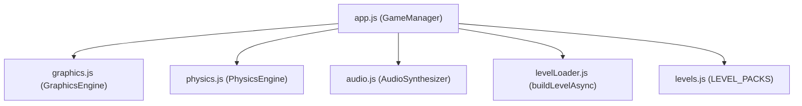

# 🌌 SkyRoads Modern WebGL Remake

[](#testing)
[](#architecture)
[](#license)

A modern, high-performance 3D WebGL clone of the classic 1993 DOS game **Sky Roads**, built using vanilla ES Modules, **Three.js** for hardware-accelerated 3D rendering, **Web Audio API** for real-time procedural sound synthesis, and **Vite** for a modern build pipeline.

Enjoy the classic high-speed stellar navigation with a polished, fully-responsive cyberpunk/synthwave user interface, interactive ship customized color/skin pickers, dynamic scenery, smooth chase camera logic, and procedural audio with absolutely zero external assets to download!

---

## 🚀 Quick Start & Setup

Get the game running locally in under a minute.

### 📦 Prerequisites
- **Node.js** (v18.x or higher recommended)
- **npm** (v9.x or higher)

### 🛠️ Installation
1. Clone the repository and navigate to the project directory:
   ```bash
   cd "Sky roads"
   ```
2. Install all development and production dependencies:
   ```bash
   npm install
   ```

### 🏃 Running the Application
| Action | Command | Description |
|---|---|---|
| **Development** | `npm run dev` | Spins up the Vite dev server with Hot Module Replacement (HMR) at `http://localhost:3000`. |
| **Production Build** | `npm run build` | Bundles and minifies the application using `esbuild` into the `dist/` directory. |
| **Preview Build** | `npm run preview` | Serves the locally compiled production bundle from `dist/` for performance testing. |
| **Run Tests** | `npm run test` | Executes the complete test suite of **349 unit tests** using **Vitest**. |

---

## 🕹️ Gameplay Controls

Control your spacecraft with high precision using the keyboard or mouse.

### ✈️ Flight Controls
* **Accelerate:** `W` or `ArrowUp` (increases forward speed)
* **Brake / Slow Down:** `S` or `ArrowDown` (reduces forward speed)
* **Steer Left:** `A` or `ArrowLeft` (moves lateral position left)
* **Steer Right:** `D` or `ArrowRight` (moves lateral position right)
* **Jump:** `Space` (initiates thruster leap over gaps and obstacles)
* **Mouse Flight Toggle:** Click the **MOUSE PLAY: ON/OFF** button in the main menu to steer and accelerate the ship using cursor movement.

### 🎥 Camera Viewport Adjustments
* **Toggle Camera Mode (`C`):** Swaps between default smooth chase cam, closer cockpit view, and higher cinematic tracking perspectives.
* **Zoom In (`[`):** Bracket Left decreases camera follow distance.
* **Zoom Out (`]`):** Bracket Right increases camera follow distance.
* **Lower Height (`-`):** Minus key decreases camera elevation offset.
* **Raise Height (`=`):** Equal key increases camera elevation offset.

### 🖥️ Menu Navigation (No Mouse Needed)
* **Navigate Up/Down:** `W` / `S` or `ArrowUp` / `ArrowDown` (cycles through available buttons or selections)
* **Navigate Left/Right:** `A` / `D` or `ArrowLeft` / `ArrowRight` (moves across grid selections)
* **Select Option:** `Space` or `Enter` (activates highlighted menu item)

---

## 📐 Project Architecture & Module Structure

The project implements a clean, flat **hub-and-spoke architecture** with zero complex SPA framework overhead. `app.js` serves as the central game orchestrator importing and wiring specialized subsystems.



### 📂 Key Module Descriptions

*   **`app.js` (Game Orchestrator & State Controller)**
    Manages the overall game loop and coordinates the global finite state machine (`menu`, `loading`, `level_select`, `ship_picker`, `playing`, `death`, `success`). It updates the responsive DOM-based HUD gauges (telemetry for speed, fuel, oxygen, progress) and coordinates scene re-loading.
*   **`graphics.js` (Three.js Rendering Engine)**
    Sets up the WebGL renderer with anti-aliasing, shadow mapping, exponential fog, and tone mapping. It spawns the 2,000-star parallax skybox, synthwave sun disc, 3D low-poly procedural city flanking the roads, and manages complex particle systems for engine thrusters and explosive destruction.
*   **`physics.js` (Physics Simulation & Collisions)**
    Simulates three-axis motion, drag, gravity scaling, and rebound logic. Collision detection uses highly-optimized axis-aligned bounding boxes (AABBs) to test intersections between the ship and level geometry, and resolves resource drainage and terrain effects (boost, sticky, slippery, burning, refill).
*   **`levelLoader.js` (Level Geometry Builder)**
    Asynchronously parses the level rows to build Three.js geometries. Instantiates flat segments, obstacles (half/full blocks), translucent glowing archways/tunnels, and maps palette colors to material values.
*   **`audio.js` (Web Audio API Synthesizer)**
    Procedurally synthesizes all game audio in real time directly inside the browser using native oscillators, noise buffers, and filters. **No audio sample downloads required!** Features an engine hum that scales pitch with velocity, jump sweeps, refill chimes, boost sweeps, wall collisions, landing rebounds, and victory arpeggios.
*   **`levels.js` (Static level pack data)**
    Contains compressed JSON data extracted offline from original DOS `.LZS` files, housing all 62 levels (31 Standard Pack + 31 Christmas Special Pack) complete with gravity modifiers, starting fuel/oxygen levels, and 16-color retro color palettes.

---

## 📖 Detailed Documentation

For a deep dive into the inner workings of the game, refer to our comprehensive manuals under the `docs/` directory:

1.  **[Architecture Overview (`docs/architecture.md`)](./docs/architecture.md)**
    Contains block diagrams, complete data-flow charts of the game loop, level loading pipelines, and the internal Finite State Machine (FSM) diagrams.
2.  **[Module Map & Symbol Reference (`docs/module-map.md`)](./docs/module-map.md)**
    An exhaustive reference list documenting all exported classes, methods, signatures, parameters, constants, and layout specifications.

---

## 🎨 Special Terrain Colors & Tile Behaviors

Just like the classic DOS original, tile colors map to unique gameplay behaviors:

| Color | Terrain Type | Behavior & Special Effects | Glow Color |
| :---: | :--- | :--- | :---: |
| 🟢 | **Boost** | Massively accelerates ship forward speed beyond standard limits. | Lime Green |
| 🔵 | **Refill** | Instantly replenishes fuel and oxygen reserves back to maximum levels. | Bright Blue |
| 🟤 | **Sticky** | Extreme friction that drops ship speed to a crawl and prevents jumping. | Dark Green |
| ⚪ | **Slippery** | Negates steering lateral friction, causing the ship to drift on ice. | Dark Gray |
| 🔴 | **Burning** | Extremely dangerous. Ignites the hull, causing immediate death on touch. | Neon Red |

---

## 🛠️ Code Quality Guidelines & Best Practices

The codebase is built and maintained following strict engineering rules to guarantee stability, modularity, and readable structure:

### 🧩 Immutability First
*   State transitions and complex updates return new configurations or objects instead of mutating in place.
*   Spread operators and pure mapping functions are preferred over side-effect manipulations (e.g., in UI adjustments or preview configurations).

### 📐 High Cohesion & Low Coupling
*   Each script is strictly single-responsibility and focused.
*   File lengths are kept small and readable (all core modules are strictly within ~200 to ~400 lines, ensuring easy comprehension and high maintainability).

### 🛡️ Comprehensive Defensive Error Handling
*   No silent failures. All operations (such as the browser’s Web Audio API initialization, storage retrieval, and asynchronous level loading) are wrapped in custom `try/catch` handlers with user-friendly warnings and server-side logs.
*   Input validations at all boundaries protect against undefined keyboard events and runtime property lookups.

### 🧪 Test-Driven Development (TDD)
*   A robust test suite of **349 unit tests** covers every module (`physics`, `graphics`, `levelLoader`, `app`, `audio`, and `preview`).
*   Mocking is strictly implemented for browser APIs (like Three.js components and AudioContexts) using Vitest and jsdom.
*   Tests are deterministic, independent, and focus on validating functionality and robust edge-case handling.

---

## 📜 License

This project is licensed under the MIT License - see the LICENSE file for details.
