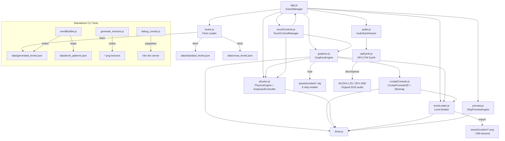
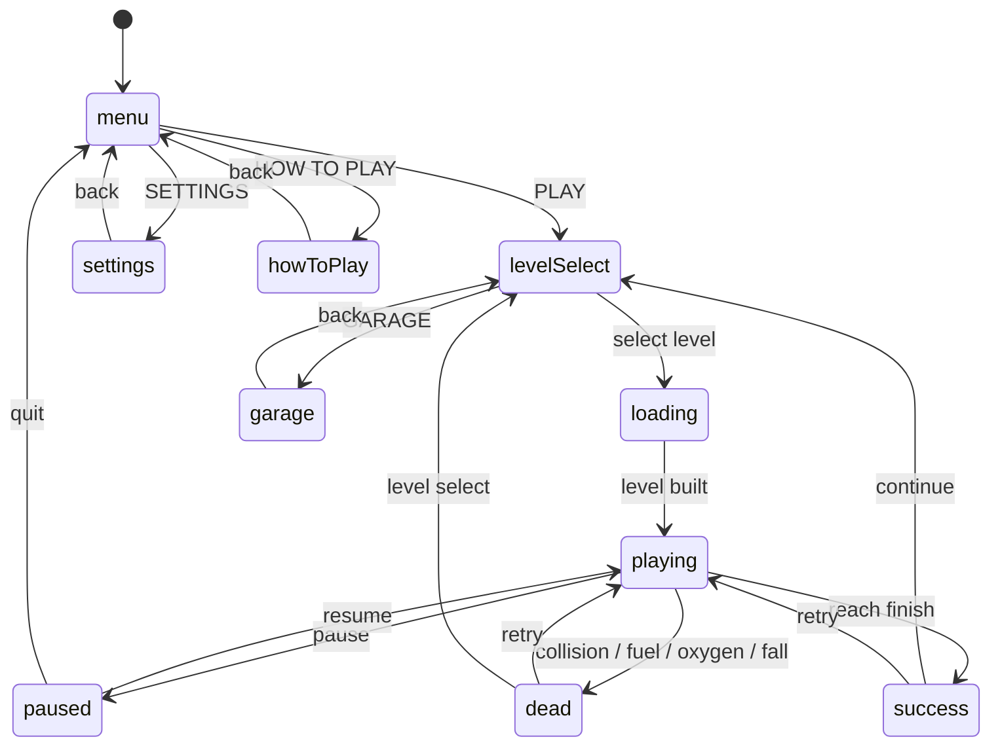
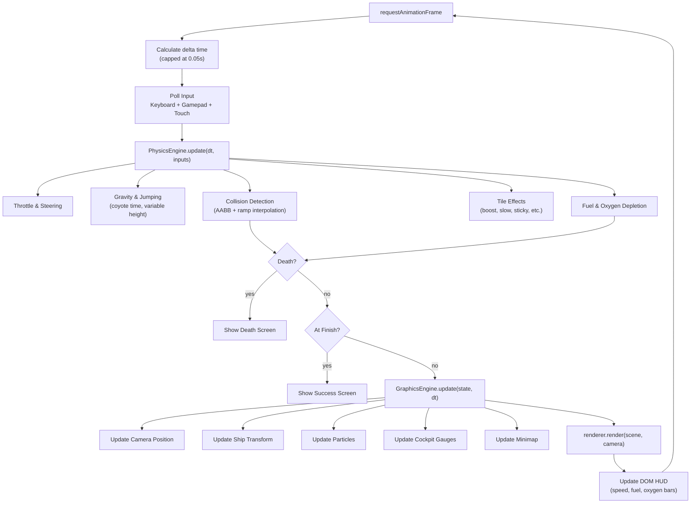
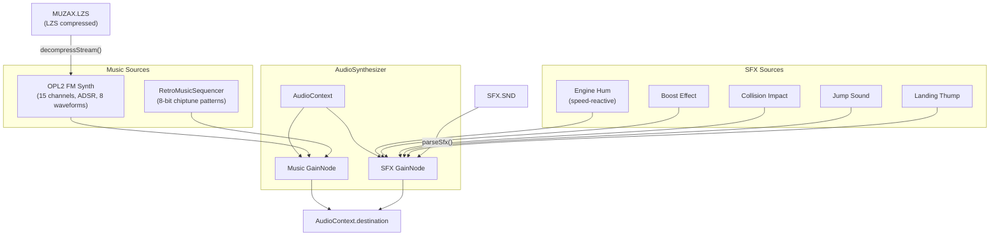
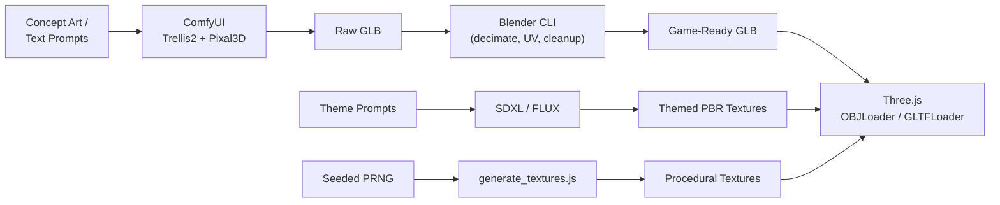

# SkyRoads WebGL — Architecture

> **Last updated:** 2026-06-04
> Definitive architectural reference for the SkyRoads WebGL project.

---

## Project Overview

| Component | Technology |
|-----------|------------|
| **Runtime** | Browser (ES Modules) |
| **3D Engine** | Three.js ^0.175.0 |
| **Build Tool** | Vite ^6.3.5 |
| **Test Runner** | Vitest ^3.1.4 + jsdom |
| **Audio** | Web Audio API + OPL2 FM Synthesis |
| **Fonts** | Google Fonts (Orbitron, Outfit) |
| **Deployment** | GitHub Pages (automated via Actions) |
| **Package** | npm (ES module, `type: "module"`) |

---

## Source File Inventory

| File | Size | Lines | Responsibility |
|------|------|-------|----------------|
| [app.js](file:///c:/dev/Sky%20roads/app.js) | 111 KB | ~2,797 | GameManager — state machine, UI, game loop, input, garage, settings |
| [graphics.js](file:///c:/dev/Sky%20roads/graphics.js) | 93 KB | ~1,800 | Three.js rendering, particles, skybox, theming, ship models |
| [levelLoader.js](file:///c:/dev/Sky%20roads/levelLoader.js) | 88 KB | ~2,200 | Level geometry builder, themed textures, async building, VRAM disposal |
| [index.css](file:///c:/dev/Sky%20roads/index.css) | 78 KB | ~3,145 | Retro-futuristic glassmorphism design system |
| [index.html](file:///c:/dev/Sky%20roads/index.html) | 61 KB | ~967 | Full game UI — menus, HUD, settings, garage, touch controls |
| [worldBuilder.js](file:///c:/dev/Sky%20roads/worldBuilder.js) | 50 KB | ~1,695 | Procedural level generation (standalone CLI) |
| [physics.js](file:///c:/dev/Sky%20roads/physics.js) | 42 KB | ~850 | Physics engine, collision, ship class presets, keyboard/gamepad input |
| [audio.js](file:///c:/dev/Sky%20roads/audio.js) | 41 KB | ~1,281 | Web Audio synthesizer, music sequencer, SFX |
| [cockpitConsole.js](file:///c:/dev/Sky%20roads/cockpitConsole.js) | 35 KB | ~400 | 3D cockpit dashboard HUD + path scanner minimap |
| [touchControls.js](file:///c:/dev/Sky%20roads/touchControls.js) | 24 KB | ~751 | Touch input manager — individual button system |
| [preview.js](file:///c:/dev/Sky%20roads/preview.js) | 23 KB | ~600 | Ship garage preview engine (isolated Three.js scene) |
| [oplSynth.js](file:///c:/dev/Sky%20roads/oplSynth.js) | 19 KB | ~637 | OPL2 FM synthesis + LZS decompressor |
| [generate_textures.js](file:///c:/dev/Sky%20roads/generate_textures.js) | 18 KB | ~511 | Procedural PNG texture generator (standalone CLI) |
| [debug_coords.js](file:///c:/dev/Sky%20roads/debug_coords.js) | 7 KB | ~220 | Puppeteer-based UI debug automation |
| [levels.js](file:///c:/dev/Sky%20roads/levels.js) | 2 KB | ~78 | Level pack fetch + cache loader |

---

## Module Dependency Graph

---

## Game State Machine

---

## Game Loop Data Flow

---

## Rendering Pipeline

```mermaid
flowchart LR
    subgraph Scene["Three.js Scene"]
        SKY["Procedural Skybox<br/>(stars, nebulae, planets)"]
        ROAD["Road Segments<br/>(themed textures + decals)"]
        OBS["Obstacles<br/>(themed materials)"]
        TUN["Tunnels<br/>(archway models + interior)"]
        SHIP["Ship Model<br/>(OBJ/GLB + skin + accent)"]
        PART["Particle Systems<br/>(exhaust, explosions, sparks)"]
        COCK["Cockpit Console<br/>(3D gauges, LCD, wings)"]
        MINI["Minimap<br/>(canvas-based path scanner)"]
    end
    
    Scene --> RENDERER["WebGLRenderer"]
    RENDERER --> CANVAS["HTMLCanvasElement"]
    CANVAS --> DOM["DOM HUD Overlay<br/>(speed/fuel/oxygen bars)"]
```

---

## Audio Architecture

---

## Input Systems

### 1. Keyboard
- **WASD / Arrow keys** — steering and throttle
- **Space** — jump
- **Shift** — brake
- Handled by `KeyboardController` class in [physics.js](file:///c:/dev/Sky%20roads/physics.js)

### 2. Xbox Gamepad
- `GamepadManager` class in [app.js](file:///c:/dev/Sky%20roads/app.js)
- Configurable button mapping for 7 actions (stored in localStorage)
- Analog stick deadzone configuration
- Menu navigation support
- Polling via Gamepad API

### 3. Touch Controls
- `TouchControlManager` class in [touchControls.js](file:///c:/dev/Sky%20roads/touchControls.js)
- Virtual analog stick (PS2-style)
- D-pad mode alternative
- Throttle axis (vertical joystick maps to forward/backward)
- Boat throttle mode (joystick Y disables drag for zero-stick = coast)
- Drag-to-reposition all control groups
- Touch customizer dashboard (type, scale, swap sides, button config)
- Lane-snapping magnetism for mobile

### 4. Mouse
- Optional mouse steering mode
- Toggle in settings

---

## Theme System

14 visual themes assigned per-level via `getThemeForLevel()`:

| # | Theme | Description |
|---|-------|-------------|
| 1 | `core` | Default base theme |
| 2 | `cyberpunk` | Neon-lit futuristic city |
| 3 | `industrial` | Heavy metal, riveted panels |
| 4 | `organic` | Bio-mechanical, living surfaces |
| 5 | `alien` | Extraterrestrial, exotic materials |
| 6 | `furnace` | Volcanic, molten metal |
| 7 | `glitch` | Digital corruption, pixelated |
| 8 | `pulse` | Energy waves, electric |
| 9 | `ridge` | Rocky, mountainous terrain |
| 10 | `shallows` | Underwater, aquatic |
| 11 | `spire` | Crystal towers, glass |
| 12 | `thrill` | High-speed, racing |
| 13 | `tundra` | Frozen, icy landscape |
| 14 | `void` | Dark space, emptiness |

Each theme provides: road diffuse+normal, obstacle diffuse+normal, tunnel diffuse+normal, 6 decal variants.

VRAM managed by `disposeUnusedThemes()` which releases GPU textures for inactive themes.

---

## Ship Class System

6 ship classes, each with unique physics tuning. Selected in the Garage, persisted to localStorage:

| Class | Max Speed | Accel | Steer | Drag | Character |
|-------|-----------|-------|-------|------|-----------|
| `original` | Baseline | Baseline | Baseline | Baseline | Faithful DOS recreation |
| `fighter` | High | High | High | High | Fast, agile, burns fuel |
| `scout` | Medium | Very High | Very High | Medium | Quick acceleration, nimble |
| `hauler` | Low | Low | Low | Low | Slow, fuel efficient |
| `dreadnought` | Very High | Medium | Low | Low | Fast but hard to steer |
| `cruiser` | Medium-High | Medium | Medium | Medium | Balanced all-rounder |

---

## Level System

| Pack | Source | Count | Data File |
|------|--------|-------|-----------|
| Standard | Original 1993 DOS SkyRoads | 31 levels (10 worlds × 3 + extras) | `data/standard_levels.json` |
| Xmas Special | SkyRoads Xmas Special | 31 levels | `data/xmas_levels.json` |
| Generated | Procedural (worldBuilder.js) | 30 levels (index 61–90) | `data/generated_levels.json` |

Level patterns extracted from the original game are stored in `data/level_patterns.json` (52 KB) and used by `worldBuilder.js` for procedural generation.

Each generated level is validated by a static physics solver to ensure it is completable before being accepted.

---

## Asset Pipeline

**Asset Counts:**
- 6 OBJ models + 6 GLB models + tunnel archway (OBJ + GLB)
- ~269 PNG textures across 14 themes
- 30 per-level asset directories (`level_61` through `level_90`)
- 4+ Blender source files with cleanup scripts
- 2 procedurally generated textures
- 6 GLTF reference asset packs (skybox, textures)

---

## Test Architecture

20 test files in `tests/`, powered by Vitest + jsdom:

| Test File | Module Under Test | Focus |
|-----------|-------------------|-------|
| `app.test.js` | GameManager | Full DOM lifecycle, state machine, settings, scoring |
| `graphics.test.js` | GraphicsEngine | Scene, camera, particles, ship mesh, skybox |
| `physics.test.js` | PhysicsEngine | Acceleration, collision, jump, effects, death |
| `levelLoader.test.js` | buildLevel() | Tile types, blocks, tunnels, finish line, gravity |
| `audio.test.js` | AudioSynthesizer | Engine sounds, SFX, music sequencer, volume |
| `cockpitConsole.test.js` | CockpitConsole3D | Gauges, minimap, frustum positioning |
| `touchControls.test.js` | TouchControlManager | Analog stick, D-pad, layout validation |
| `shipStats.test.js` | CLASS_PRESETS | Ship classes, applyShipClass, localStorage |
| `gamepad.test.js` | GamepadManager | Input mapping, deadzone, multi-gamepad |
| `ramps.test.js` | Ramp physics | Height interpolation, collision, transitions |
| `worldBuilder.test.js` | Generated levels | Data integrity, 30 levels, palette validation |
| `preview.test.js` | ShipPreviewEngine | Garage preview, skin/model swapping, cleanup |
| `settingsToggles.test.js` | Settings UI | Throttle, cockpit, fullscreen toggles |
| `laneSnapToggles.test.js` | Lane snapping | Enable/disable, strength config |
| `dynamicSkinning.test.js` | Theme system | 14 themes, VRAM management, texture cache |
| `classicAudio.test.js` | Classic audio | Retro vs classic toggle, track cycling |
| `generate.test.js` | Asset pipeline | Model/texture generation validation |
| `playtest_run.test.js` | Playtest system | Automated screenshot pipeline |
| `assets.test.js` | Asset files | Model/texture existence verification |
| `analyze.test.js` | Level analysis | Pattern extraction validation |

**Test setup:** [vitest.setup.js](file:///c:/dev/Sky%20roads/vitest.setup.js) generates stub OBJ models and PNG textures before tests run.

---

## CI/CD

### GitHub Pages Deployment

File: [.github/workflows/deploy.yml](file:///c:/dev/Sky%20roads/.github/workflows/deploy.yml)

**Trigger:** Push to `main` branch
**Runner:** ubuntu-latest
**Pipeline:** Checkout → Node 20 → `npm ci` → `npm run build` → Deploy `./dist` to GitHub Pages

---

## Key Design Decisions

1. **Single HTML page** with overlay panels for all screens — no routing needed
2. **ES modules throughout** — no bundler plugins required, clean import graph
3. **Three.js for everything 3D** — including cockpit HUD, not just game world
4. **Original DOS data files included** — MUZAX.LZS, SFX.SND for authentic audio
5. **Dual audio system** — procedural synthesizer + OPL2 FM for retro authenticity
6. **LocalStorage for all persistence** — progress, settings, ship config, leaderboards
7. **Responsive design** with dedicated mobile touch controls and customizer
8. **Theme-per-level visual variety** — 14 themes prevent visual monotony
9. **Physics presets per ship class** — different handling characteristics per ship
10. **Automated visual playtest pipeline** — Puppeteer screenshots for regression
11. **Standalone CLI scripts** for asset generation — decoupled from game runtime
12. **Static physics solver** validates procedurally generated levels are completable
