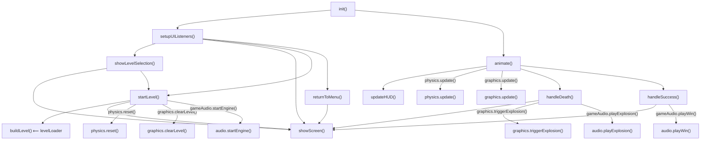
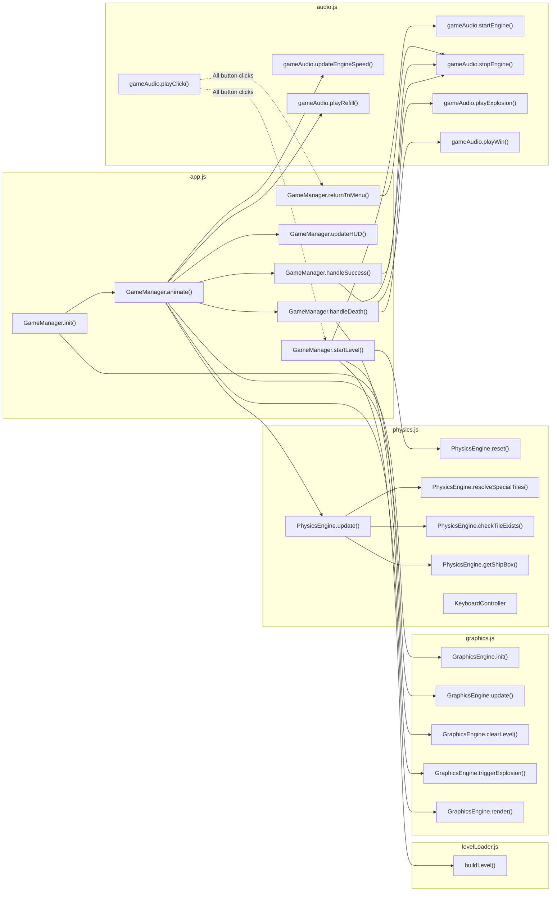

# SkyRoads WebGL — Module Map & Symbol Reference

> Detailed per-module code maps with exported symbols, function signatures, constants, call relationships, and DOM/CSS references.

---

## Table of Contents

1. [app.js — Game Orchestrator](#appjs--game-orchestrator)
2. [graphics.js — Rendering Engine](#graphicsjs--rendering-engine)
3. [physics.js — Physics Engine & Input](#physicsjs--physics-engine--input)
4. [levelLoader.js — Level Geometry Builder](#levelloaderjs--level-geometry-builder)
5. [audio.js — Sound Synthesizer](#audiojs--sound-synthesizer)
6. [levels.js — Level Data Store](#levelsjs--level-data-store)
7. [index.html — DOM Element Map](#indexhtml--dom-element-map)
8. [index.css — Design System](#indexcss--design-system)
9. [Cross-Module Call Graph](#cross-module-call-graph)

---

## app.js — Game Orchestrator

**File:** [app.js](file:///c:/dev/Sky%20roads/app.js) · 334 lines · 11 KB

### Imports

| Symbol | Source |
|--------|--------|
| `LEVEL_PACKS` | [levels.js](file:///c:/dev/Sky%20roads/levels.js) |
| `GraphicsEngine` | [graphics.js](file:///c:/dev/Sky%20roads/graphics.js) |
| `PhysicsEngine`, `KeyboardController`, `SHIP_LENGTH` | [physics.js](file:///c:/dev/Sky%20roads/physics.js) |
| `buildLevel` | [levelLoader.js](file:///c:/dev/Sky%20roads/levelLoader.js) |
| `gameAudio` | [audio.js](file:///c:/dev/Sky%20roads/audio.js) |

### Exports

> **None** — `app.js` is the entry point. It self-initializes via `DOMContentLoaded` event.

### Class: `GameManager`

Defined at [L8–L327](file:///c:/dev/Sky%20roads/app.js#L8-L327). Not exported; instantiated at module load.

#### Constructor Properties

| Property | Type | Initial Value | Purpose |
|----------|------|---------------|---------|
| `graphics` | `GraphicsEngine` | `new GraphicsEngine()` | 3D rendering subsystem |
| `physics` | `PhysicsEngine` | `new PhysicsEngine()` | Physics simulation |
| `keyboard` | `KeyboardController` | `new KeyboardController()` | Input state tracker |
| `currentPack` | `string` | `'standard'` | Active level pack name |
| `currentLevelIndex` | `number` | `0` | Active level index within pack |
| `currentLevelData` | `object \| null` | `null` | Raw level data from `LEVEL_PACKS` |
| `levelInfo` | `object \| null` | `null` | Return value of `buildLevel()` |
| `gameState` | `string` | `'menu'` | FSM state: `menu`, `level_select`, `playing`, `death`, `success` |
| `lastTime` | `number` | `0` | Previous frame timestamp (ms) |
| `animationFrameId` | `number \| null` | `null` | `requestAnimationFrame` handle |
| `standardRoadNames` | `string[]` | 31 road names | Display names for standard pack levels |
| `xmasRoadNames` | `string[]` | 31 road names | Display names for xmas pack levels |

#### Methods

| Method | Signature | Lines | Description |
|--------|-----------|:-----:|-------------|
| [init](file:///c:/dev/Sky%20roads/app.js#L40-L51) | `init(): void` | 40–51 | Initializes graphics, sets up UI listeners, starts animation loop |
| [setupUIListeners](file:///c:/dev/Sky%20roads/app.js#L53-L106) | `setupUIListeners(): void` | 53–106 | Binds click handlers to all menu/navigation buttons |
| [showScreen](file:///c:/dev/Sky%20roads/app.js#L108-L120) | `showScreen(screenId: string): void` | 108–120 | Hides all overlay screens, activates target by ID |
| [showLevelSelection](file:///c:/dev/Sky%20roads/app.js#L122-L159) | `showLevelSelection(packName: string): void` | 122–159 | Dynamically builds level selection grid for given pack |
| [startLevel](file:///c:/dev/Sky%20roads/app.js#L161-L202) | `startLevel(index: number): void` | 161–202 | Clears scene, builds level geometry, resets physics, enters `playing` state |
| [returnToMenu](file:///c:/dev/Sky%20roads/app.js#L204-L209) | `returnToMenu(): void` | 204–209 | Transitions back to `menu` state, hides HUD, stops engine |
| [animate](file:///c:/dev/Sky%20roads/app.js#L211-L253) | `animate(timestamp: number): void` | 211–253 | Main game loop — dispatches to physics/graphics or idle starfield rotation |
| [updateHUD](file:///c:/dev/Sky%20roads/app.js#L256-L282) | `updateHUD(): void` | 256–282 | Refreshes speed, oxygen, fuel, and progress bar DOM elements |
| [handleDeath](file:///c:/dev/Sky%20roads/app.js#L284-L310) | `handleDeath(): void` | 284–310 | Triggers explosion, sets death message, shows death screen after 1.2s |
| [handleSuccess](file:///c:/dev/Sky%20roads/app.js#L312-L326) | `handleSuccess(): void` | 312–326 | Shows success screen, conditionally hides "Next Road" button |

#### Internal Call Graph



---

## graphics.js — Rendering Engine

**File:** [graphics.js](file:///c:/dev/Sky%20roads/graphics.js) · 413 lines · 14 KB

### Imports

| Symbol | Source |
|--------|--------|
| `* as THREE` | `three` (npm) |
| `SHIP_WIDTH`, `SHIP_HEIGHT`, `SHIP_LENGTH` | [physics.js](file:///c:/dev/Sky%20roads/physics.js) |

### Exports

| Symbol | Type | Description |
|--------|------|-------------|
| `GraphicsEngine` | `class` | Complete Three.js rendering pipeline |

### Class: `GraphicsEngine`

Defined at [L5–L412](file:///c:/dev/Sky%20roads/graphics.js#L5-L412).

#### Constructor Properties

| Property | Type | Initial Value | Purpose |
|----------|------|---------------|---------|
| `scene` | `THREE.Scene \| null` | `null` | Root scene graph |
| `camera` | `THREE.PerspectiveCamera \| null` | `null` | Viewport camera (65° FOV) |
| `renderer` | `THREE.WebGLRenderer \| null` | `null` | WebGL renderer with shadows |
| `shipMesh` | `THREE.Group \| null` | `null` | Composite ship mesh (body + wings + canopy + engines) |
| `particles` | `Particle[]` | `[]` | Active particle array for thrusters and explosions |
| `starField` | `THREE.Points \| null` | `null` | Background star particle system (2000 stars) |
| `camOffset` | `THREE.Vector3` | `(0, 1.8, 5.0)` | Chase camera position offset behind ship |
| `camTargetOffset` | `THREE.Vector3` | `(0, 0.4, -3.0)` | Camera look-at target offset ahead of ship |
| `sunLight` | `THREE.DirectionalLight` | — | Dynamic shadow-casting directional light |
| `sunMesh` | `THREE.Mesh` | — | Synthwave sun disc at horizon |
| `nozzleL` / `nozzleR` | `THREE.Mesh` | — | Thruster nozzle meshes (emissive magenta) |

#### Particle Object Shape

```typescript
{
  mesh:    THREE.Mesh,      // Sphere geometry particle
  velocity: THREE.Vector3,  // World-space velocity
  life:    number,           // Remaining lifetime (seconds)
  maxLife: number            // Initial lifetime (for decay ratio)
}
```

#### Methods

| Method | Signature | Lines | Description |
|--------|-----------|:-----:|-------------|
| [init](file:///c:/dev/Sky%20roads/graphics.js#L19-L69) | `init(container: HTMLElement): void` | 19–69 | Creates scene, renderer, camera, lighting, skybox, ship; binds resize |
| [createSkybox](file:///c:/dev/Sky%20roads/graphics.js#L71-L147) | `createSkybox(): void` | 71–147 | Builds 2000-star particle sphere, synthwave grid, neon sun disc |
| [createShipMesh](file:///c:/dev/Sky%20roads/graphics.js#L149-L235) | `createShipMesh(): void` | 149–235 | Builds composite ship: cone body, box wings, sphere canopy, cylinder engines |
| [update](file:///c:/dev/Sky%20roads/graphics.js#L238-L281) | `update(physics: PhysicsEngine, dt: number): void` | 238–281 | Positions ship, chase camera lerp, sun/starfield parallax, particle update |
| [updateParticles](file:///c:/dev/Sky%20roads/graphics.js#L284-L343) | `updateParticles(physics: PhysicsEngine, dt: number): void` | 284–343 | Spawns thruster flames, decays/removes expired particles |
| [triggerExplosion](file:///c:/dev/Sky%20roads/graphics.js#L346-L385) | `triggerExplosion(position: THREE.Vector3): void` | 346–385 | Spawns 180 neon particles in random spherical directions, hides ship |
| [clearLevel](file:///c:/dev/Sky%20roads/graphics.js#L387-L398) | `clearLevel(): void` | 387–398 | Makes ship visible, disposes and clears all particles |
| [handleResize](file:///c:/dev/Sky%20roads/graphics.js#L400-L405) | `handleResize(container: HTMLElement): void` | 400–405 | Updates camera aspect ratio and renderer size |
| [render](file:///c:/dev/Sky%20roads/graphics.js#L407-L411) | `render(): void` | 407–411 | Calls `renderer.render(scene, camera)` |

#### Renderer Configuration

| Setting | Value |
|---------|-------|
| Antialiasing | `true` |
| Pixel Ratio | `min(devicePixelRatio, 2)` |
| Shadow Map | PCFSoftShadowMap, 1024×1024 |
| Tone Mapping | ACES Filmic, exposure 1.0 |
| Scene Fog | FogExp2, color `0x0a0519`, density `0.007` |

---

## physics.js — Physics Engine & Input

**File:** [physics.js](file:///c:/dev/Sky%20roads/physics.js) · 375 lines · 13 KB

### Imports

| Symbol | Source |
|--------|--------|
| `* as THREE` | `three` (npm) |

### Exports

| Symbol | Type | Description |
|--------|------|-------------|
| `ROAD_WIDTH_LANES` | `const number` | `7` — lanes per row |
| `TILE_WIDTH` | `const number` | `2.0` — world units per tile width |
| `TILE_LENGTH` | `const number` | `4.0` — world units per tile depth |
| `TOTAL_ROAD_WIDTH` | `const number` | `14.0` — total road width (`7 × 2.0`) |
| `SHIP_WIDTH` | `const number` | `1.0` — ship bounding box width |
| `SHIP_HEIGHT` | `const number` | `0.4` — ship bounding box height |
| `SHIP_LENGTH` | `const number` | `1.8` — ship bounding box length |
| `PhysicsEngine` | `class` | Core physics simulation |
| `KeyboardController` | `class` | Keyboard input state manager |

### Constants Table

| Constant | Value | Meaning |
|----------|------:|---------|
| `ROAD_WIDTH_LANES` | 7 | Number of tile columns in each row |
| `TILE_WIDTH` | 2.0 | Width of one tile in world units |
| `TILE_LENGTH` | 4.0 | Depth (Z-length) of one tile in world units |
| `TOTAL_ROAD_WIDTH` | 14.0 | Full road width = `TILE_WIDTH × ROAD_WIDTH_LANES` |
| `SHIP_WIDTH` | 1.0 | Ship collision box width |
| `SHIP_HEIGHT` | 0.4 | Ship collision box height |
| `SHIP_LENGTH` | 1.8 | Ship collision box length (nose to tail) |

### Class: `PhysicsEngine`

Defined at [L15–L346](file:///c:/dev/Sky%20roads/physics.js#L15-L346).

#### Constructor Properties

| Property | Type | Initial | Purpose |
|----------|------|---------|---------|
| `position` | `THREE.Vector3` | `(0, 0.2, 0)` | Ship world position |
| `velocity` | `THREE.Vector3` | `(0, 0, 0)` | Ship velocity (negative Z = forward) |
| `maxSpeedNormal` | `number` | `32.0` | Normal max forward speed (units/s) |
| `maxSpeedBoost` | `number` | `60.0` | Boosted max forward speed |
| `maxSpeedSticky` | `number` | `10.0` | Sticky tile speed cap |
| `accelForward` | `number` | `18.0` | Forward acceleration rate |
| `decelBrakes` | `number` | `35.0` | Braking deceleration rate |
| `dragZ` | `number` | `4.0` | Natural forward drag |
| `maxSteerSpeed` | `number` | `10.0` | Max lateral speed |
| `steerAccel` | `number` | `35.0` | Steering acceleration |
| `dragSteer` | `number` | `28.0` | Steering drag (stabilization) |
| `jumpImpulse` | `number` | `10.5` | Initial Y velocity on jump |
| `onGround` | `boolean` | `true` | Currently touching ground |
| `groundHeight` | `number` | `0` | Y-level of current ground |
| `isDead` | `boolean` | `false` | Death flag |
| `deathReason` | `string` | `''` | Death cause for display |
| `activeEffects` | `object` | `{boost:false, sticky:false, slippery:false, burning:false}` | Active special tile effects |
| `oxygen` | `number` | `100` | Current oxygen (0–100) |
| `fuel` | `number` | `10000` | Current fuel (scaled from DOS value) |
| `triggerRefillAudio` | `boolean` | `false` | Flag for app.js to play refill sound |

#### Death Reasons

| `deathReason` Value | Trigger Condition |
|---------------------|-------------------|
| `'OUT OF FUEL'` | `fuel <= 0` |
| `'OUT OF OXYGEN'` | `oxygen <= 0` |
| `'BURNED TO CRIPPLES'` | Standing on burning tile (`top_color === 13`) |
| `'COLLIDED WITH BLOCK'` | Front of ship hits obstacle AABB |
| `'FELL OFF ROAD'` | `position.y < -4.0` |

#### Methods

| Method | Signature | Lines | Description |
|--------|-----------|:-----:|-------------|
| [reset](file:///c:/dev/Sky%20roads/physics.js#L52-L68) | `reset(startFuel: number, startOxygen: number): void` | 52–68 | Resets position, velocity, death state, fuel/oxygen |
| [update](file:///c:/dev/Sky%20roads/physics.js#L70-L263) | `update(dt: number, keyboard: KeyboardController, levelInfo: LevelInfo): void` | 70–263 | Main physics step: resources, effects, movement, collisions |
| [checkTileExists](file:///c:/dev/Sky%20roads/physics.js#L266-L290) | `checkTileExists(x: number, z: number, levelInfo: LevelInfo): boolean` | 266–290 | Checks if a flat tile exists at world coords (uses `window.currentLevelData`) |
| [getShipBox](file:///c:/dev/Sky%20roads/physics.js#L293-L305) | `getShipBox(): AABB` | 293–305 | Returns ship bounding box `{minX, maxX, minY, maxY, minZ, maxZ}` |
| [resolveSpecialTiles](file:///c:/dev/Sky%20roads/physics.js#L308-L345) | `resolveSpecialTiles(specialTiles: SpecialTile[]): void` | 308–345 | Tests AABB overlaps with special tiles, sets `activeEffects` and refill |

### Class: `KeyboardController`

Defined at [L349–L373](file:///c:/dev/Sky%20roads/physics.js#L349-L373).

#### Properties

| Property | Type | Purpose |
|----------|------|---------|
| `forward` | `boolean` | Up arrow / W pressed |
| `backward` | `boolean` | Down arrow / S pressed |
| `left` | `boolean` | Left arrow / A pressed |
| `right` | `boolean` | Right arrow / D pressed |
| `jump` | `boolean` | Space pressed |

#### Methods

| Method | Signature | Description |
|--------|-----------|-------------|
| [handleKey](file:///c:/dev/Sky%20roads/physics.js#L361-L368) | `handleKey(e: KeyboardEvent, isDown: boolean): void` | Maps key codes to boolean flags |
| [resetJump](file:///c:/dev/Sky%20roads/physics.js#L370-L372) | `resetJump(): void` | Sets `jump = false` to prevent double-jump |

#### Key Bindings

| Key Code | Alternative | Action |
|----------|-------------|--------|
| `ArrowUp` | `KeyW` | `forward` |
| `ArrowDown` | `KeyS` | `backward` |
| `ArrowLeft` | `KeyA` | `left` |
| `ArrowRight` | `KeyD` | `right` |
| `Space` | — | `jump` |

---

## levelLoader.js — Level Geometry Builder

**File:** [levelLoader.js](file:///c:/dev/Sky%20roads/levelLoader.js) · 270 lines · 9 KB

### Imports

| Symbol | Source |
|--------|--------|
| `* as THREE` | `three` (npm) |

### Exports

| Symbol | Type | Description |
|--------|------|-------------|
| `TILE_WIDTH` | `const number` | `2.0` (duplicated from physics.js) |
| `TILE_LENGTH` | `const number` | `4.0` |
| `ROAD_WIDTH_LANES` | `const number` | `7` |
| `TOTAL_ROAD_WIDTH` | `const number` | `14.0` |
| `buildLevel` | `function` | Main level construction function |

### Function: `buildLevel`

Defined at [L10–L269](file:///c:/dev/Sky%20roads/levelLoader.js#L10-L269).

**Signature:** `buildLevel(levelData: LevelData, scene: THREE.Scene): LevelInfo`

#### Parameters

| Parameter | Type | Description |
|-----------|------|-------------|
| `levelData` | `LevelData` | Parsed level object from `LEVEL_PACKS` |
| `scene` | `THREE.Scene` | Three.js scene to add meshes to |

#### Return Value: `LevelInfo`

| Field | Type | Description |
|-------|------|-------------|
| `trackLength` | `number` | Total track depth in world units (`numRows × TILE_LENGTH`) |
| `collidables` | `AABB[]` | Array of obstacle bounding boxes |
| `specialTiles` | `SpecialTile[]` | Array of `{boundingBox, behavior}` objects |
| `finishZ` | `number` | Z-coordinate of finish line (`-trackLength - 2.0`) |
| `gravity` | `number` | Scaled gravity value (`levelData.gravity × 3.0`, default 24.0) |
| `fuel` | `number` | Initial fuel value (raw, before ×50 scaling in physics) |
| `oxygen` | `number` | Initial oxygen percentage |
| `roadMeshes` | `THREE.Mesh[]` | All created meshes for cleanup |

#### Tile Height Rules

| Condition | Height | Y Position | isObstacle |
|-----------|-------:|------------|:----------:|
| `full && half` | 3.0 | `height/2` | ✓ |
| `full` only | 2.0 | `height/2` | ✓ |
| `half` only | 1.0 | `height/2` | ✓ |
| Neither (flat) | 0.15 | `-height/2` | ✗ |

#### Special Tile Behavior Mapping

| `top_color` | Behavior | Glow Color | RGB |
|:-----------:|----------|------------|-----|
| 3 | `'sticky'` | Dark Green | `(0, 0.25, 0)` |
| 9 | `'slippery'` | Dark Gray | `(0.2, 0.2, 0.2)` |
| 10 | `'refill'` | Bright Blue | `(0, 0.5, 1.0)` |
| 11 | `'boost'` | Lime Green | `(0, 1.0, 0)` |
| 13 | `'burning'` | Bright Red | `(1.0, 0, 0)` |

#### Tunnel Architecture

When `tile.tunnel === true`, the loader creates a semi-transparent archway:
- **Left wall**: `BoxGeometry(0.15, 2.8, TILE_LENGTH)` positioned at tile left edge
- **Right wall**: Same geometry at tile right edge
- **Ceiling**: `BoxGeometry(TILE_WIDTH, 0.15, TILE_LENGTH)` at top of arch
- All three are added to `collidables[]` as obstacles
- Material: semi-transparent (`opacity: 0.35`) with emissive glow from `bottom_color`

#### Internal Helper: `getPaletteColor`

Closure at [L28–L34](file:///c:/dev/Sky%20roads/levelLoader.js#L28-L34).

**Signature:** `getPaletteColor(colorIndex: number): THREE.Color`

Converts a palette index to a Three.js Color using the level's palette array. Falls back to gray `(0.5, 0.5, 0.5)` for out-of-range indices.

---

## audio.js — Sound Synthesizer

**File:** [audio.js](file:///c:/dev/Sky%20roads/audio.js) · 241 lines · 8 KB

### Imports

> **None** — uses only native Web Audio API.

### Exports

| Symbol | Type | Description |
|--------|------|-------------|
| `gameAudio` | `AudioSynthesizer` | Singleton instance (module-level) |

### Class: `AudioSynthesizer`

Defined at [L3–L238](file:///c:/dev/Sky%20roads/audio.js#L3-L238). Not exported directly; accessed via the `gameAudio` singleton.

#### Constructor Properties

| Property | Type | Initial | Purpose |
|----------|------|---------|---------|
| `ctx` | `AudioContext \| null` | `null` | Web Audio context (lazy-initialized) |
| `engineOsc1` | `OscillatorNode` | — | Primary engine oscillator (sawtooth) |
| `engineOsc2` | `OscillatorNode` | — | Secondary engine oscillator (triangle) |
| `engineGain` | `GainNode \| null` | `null` | Engine volume control |
| `isEngineRunning` | `boolean` | `false` | Engine loop active flag |

#### Methods

| Method | Signature | Lines | Description |
|--------|-----------|:-----:|-------------|
| [init](file:///c:/dev/Sky%20roads/audio.js#L11-L18) | `init(): void` | 11–18 | Lazy-creates AudioContext (idempotent) |
| [playClick](file:///c:/dev/Sky%20roads/audio.js#L21-L39) | `playClick(): void` | 21–39 | Sine sweep 600→100 Hz over 80ms |
| [startEngine](file:///c:/dev/Sky%20roads/audio.js#L42-L70) | `startEngine(): void` | 42–70 | Starts dual-oscillator engine hum (saw 45Hz + tri 90Hz) |
| [updateEngineSpeed](file:///c:/dev/Sky%20roads/audio.js#L73-L85) | `updateEngineSpeed(ratio: number): void` | 73–85 | Modulates engine frequency and volume based on speed ratio (0–1) |
| [stopEngine](file:///c:/dev/Sky%20roads/audio.js#L88-L97) | `stopEngine(): void` | 88–97 | Stops both engine oscillators |
| [playJump](file:///c:/dev/Sky%20roads/audio.js#L100-L119) | `playJump(): void` | 100–119 | Triangle sweep 120→450 Hz over 250ms |
| [playRefill](file:///c:/dev/Sky%20roads/audio.js#L122-L150) | `playRefill(): void` | 122–150 | Two-note chime: C5 (523 Hz) then G5 (784 Hz) |
| [playBoost](file:///c:/dev/Sky%20roads/audio.js#L153-L172) | `playBoost(): void` | 153–172 | Sawtooth sweep 200→800 Hz over 400ms |
| [playExplosion](file:///c:/dev/Sky%20roads/audio.js#L175-L211) | `playExplosion(): void` | 175–211 | 1.2s brown noise burst through low-pass filter (600→60 Hz) |
| [playWin](file:///c:/dev/Sky%20roads/audio.js#L214-L237) | `playWin(): void` | 214–237 | C-major arpeggio: C4→E4→G4→C5, 100ms apart |

#### Sound Design Reference

| Sound | Waveform | Frequency Range | Duration | Notes |
|-------|----------|-----------------|----------|-------|
| Click | Sine | 600 → 100 Hz | 80ms | Exponential ramp |
| Engine Osc 1 | Sawtooth | 45 → 105 Hz | Continuous | Speed-modulated |
| Engine Osc 2 | Triangle | 90 → 210 Hz | Continuous | Speed-modulated |
| Jump | Triangle | 120 → 450 Hz | 250ms | Exponential ramp |
| Refill | Sine × 2 | C5 + G5 | 200ms | Sequential notes |
| Boost | Sawtooth | 200 → 800 Hz | 400ms | Exponential ramp |
| Explosion | Brown noise | 600 → 60 Hz LP | 1200ms | Buffer source + biquad filter |
| Win | Triangle × 4 | C4, E4, G4, C5 | 400ms each | Staggered 100ms arpeggio |

---

## levels.js — Level Data Store

**File:** [levels.js](file:///c:/dev/Sky%20roads/levels.js) · 283,458 lines · 6.3 MB

### Imports

> **None** — pure data module.

### Exports

| Symbol | Type | Description |
|--------|------|-------------|
| `LEVEL_PACKS` | `object` | Contains `standard` (31 levels) and `xmas` (31 levels) arrays |

### Data Structure

```
LEVEL_PACKS: {
  standard: LevelData[31],
  xmas:     LevelData[31]
}
```

Each `LevelData` object contains:
- `level_index` — ordinal within pack
- `gravity` — DOS gravity value (typically 6–12)
- `fuel` — starting fuel (typically 50–200)
- `oxygen` — starting oxygen (typically 40–80)
- `palette` — array of 16+ `[r, g, b]` triples (0–255 range, with fade variants)
- `rows` — array of tile rows, each row is `(Tile | null)[7]`

---

## index.html — DOM Element Map

**File:** [index.html](file:///c:/dev/Sky%20roads/index.html) · 154 lines · 6 KB

### Element ID Reference

Every DOM element accessed by JavaScript, organized by screen:

#### Canvas & HUD

| ID | Element | Used By | Purpose |
|----|---------|---------|---------|
| `canvas-container` | `div` | `graphics.init()` | WebGL renderer mount point |
| `hud` | `div` | `startLevel()`, `returnToMenu()` | HUD container (show/hide) |
| `hud-speed-text` | `span` | `updateHUD()` | Speed numeric readout |
| `hud-speed-bar` | `div` | `updateHUD()` | Speed bar fill width |
| `hud-oxygen-text` | `div` | `updateHUD()` | Oxygen numeric readout |
| `hud-oxygen-bar` | `div` | `updateHUD()` | Oxygen bar fill width |
| `hud-fuel-text` | `div` | `updateHUD()` | Fuel numeric readout |
| `hud-fuel-bar` | `div` | `updateHUD()` | Fuel bar fill width |
| `hud-progress-bar` | `div` | `updateHUD()` | Progress bar fill width |
| `hud-progress-marker` | `div` | `updateHUD()` | Progress marker dot position |

#### Menu Screen

| ID | Element | Used By | Purpose |
|----|---------|---------|---------|
| `menu-screen` | `div` | `showScreen()` | Main menu overlay (default active) |
| `btn-play-standard` | `button` | `setupUIListeners()` | Start standard pack |
| `btn-play-xmas` | `button` | `setupUIListeners()` | Start xmas pack |
| `btn-how-to` | `button` | `setupUIListeners()` | Open how-to screen |

#### Level Selection Screen

| ID | Element | Used By | Purpose |
|----|---------|---------|---------|
| `level-screen` | `div` | `showScreen()` | Level selection overlay |
| `level-pack-title` | `h2` | `showLevelSelection()` | Pack title text |
| `level-grid` | `div` | `showLevelSelection()` | Dynamic level button grid container |
| `btn-level-back` | `button` | `setupUIListeners()` | Return to menu |

#### Death Screen

| ID | Element | Used By | Purpose |
|----|---------|---------|---------|
| `death-screen` | `div` | `showScreen()` | Death overlay |
| `death-reason` | `p` | `handleDeath()` | Death cause message |
| `btn-death-retry` | `button` | `setupUIListeners()` | Retry current level |
| `btn-death-menu` | `button` | `setupUIListeners()` | Return to menu |

#### Success Screen

| ID | Element | Used By | Purpose |
|----|---------|---------|---------|
| `success-screen` | `div` | `showScreen()` | Success overlay |
| `btn-success-next` | `button` | `setupUIListeners()`, `handleSuccess()` | Next level (conditionally hidden) |
| `btn-success-menu` | `button` | `setupUIListeners()` | Return to menu |

#### How-To Screen

| ID | Element | Used By | Purpose |
|----|---------|---------|---------|
| `how-to-screen` | `div` | `showScreen()` | How-to-play overlay |
| `btn-how-to-back` | `button` | `setupUIListeners()` | Return to menu |

### CSS Class Reference (used in HTML)

| Class | Applied To | Purpose |
|-------|-----------|---------|
| `overlay-screen` | All screens | Base screen styling + transitions |
| `active` | Current screen | Visibility + opacity (CSS transition) |
| `hidden` | Inactive elements | `display: none !important` |
| `glass-card` | All screens | Glassmorphism card styling |
| `status-card` | Death/Success | Center-aligned text layout |
| `btn`, `btn-primary`, `btn-secondary`, `btn-info` | Buttons | Button variants |
| `btn-glow` | CTA buttons | Neon glow class (used in HTML, not defined in CSS) |
| `level-item` | Dynamic level buttons | Grid item styling |
| `hud-container` | HUD root | Fullscreen overlay positioning |
| `hud-stat-box` | HUD stat cards | Glass-effect stat display |
| `speed-glow`, `oxygen-glow`, `fuel-glow`, `progress-glow` | HUD bars | Colored neon bar fills |

---

## index.css — Design System

**File:** [index.css](file:///c:/dev/Sky%20roads/index.css) · 515 lines · 11 KB

### CSS Custom Properties (`:root`)

| Property | Value | Purpose |
|----------|-------|---------|
| `--color-bg` | `hsl(260, 30%, 8%)` | Page background (deep purple-black) |
| `--color-menu-bg` | `hsla(260, 35%, 10%, 0.6)` | Semi-transparent card background |
| `--color-primary` | `hsl(320, 100%, 60%)` | Primary accent (neon pink/magenta) |
| `--color-primary-glow` | `hsla(320, 100%, 60%, 0.4)` | Primary glow shadow color |
| `--color-secondary` | `hsl(190, 100%, 50%)` | Secondary accent (neon cyan) |
| `--color-secondary-glow` | `hsla(190, 100%, 50%, 0.4)` | Secondary glow shadow color |
| `--color-text` | `hsl(0, 0%, 95%)` | Primary text (near-white) |
| `--color-text-muted` | `hsl(260, 10%, 70%)` | Dimmed text (labels, credits) |
| `--color-success` | `hsl(140, 90%, 55%)` | Success state green |
| `--color-danger` | `hsl(355, 95%, 55%)` | Danger/death state red |
| `--font-display` | `'Orbitron', system-ui, sans-serif` | Display/heading font |
| `--font-body` | `'Outfit', system-ui, sans-serif` | Body text font |
| `--shadow-neon` | `0 0 20px/40px primary-glow` | Neon glow box-shadow (primary) |
| `--shadow-neon-sec` | `0 0 20px/40px secondary-glow` | Neon glow box-shadow (secondary) |

### HUD Bar Color Scheme

| Bar | CSS Class | Color |
|-----|-----------|-------|
| Speed | `.speed-glow` | `var(--color-secondary)` — cyan |
| Oxygen | `.oxygen-glow` | `hsl(200, 100%, 60%)` — sky blue |
| Fuel | `.fuel-glow` | `hsl(45, 100%, 55%)` — gold/amber |
| Progress | `.progress-glow` | `var(--color-primary)` — magenta |

### Tile Color Swatch Classes (How-To screen)

| Class | Color | Represents |
|-------|-------|-----------|
| `.bg-refill` | `hsl(210, 100%, 50%)` | Supply refill tiles |
| `.bg-boost` | `hsl(120, 90%, 55%)` | Speed boost tiles |
| `.bg-sticky` | `hsl(120, 100%, 15%)` | Sticky slow-down tiles |
| `.bg-slippery` | `hsl(0, 0%, 30%)` | Slippery drift tiles |
| `.bg-burning` | `hsl(355, 100%, 55%)` | Burning death tiles |

### Responsive Breakpoint

| Breakpoint | Changes |
|-----------|---------|
| `max-width: 600px` | HUD stat boxes shrink, font sizes reduce, level grid becomes 4-column, logo text shrinks |

---

## Cross-Module Call Graph

This diagram shows every significant cross-module function call in the application:



### Window Global Variables (Cross-Module State)

The following `window` properties are set by [app.js startLevel()](file:///c:/dev/Sky%20roads/app.js#L166-L169) and read by [physics.js checkTileExists()](file:///c:/dev/Sky%20roads/physics.js#L280-L284):

| Global | Set By | Read By | Type | Purpose |
|--------|--------|---------|------|---------|
| `window.currentGamePack` | `app.js:167` | `physics.js:280` | `string` | Active pack name |
| `window.currentLevelIndex` | `app.js:168` | `physics.js:281` | `number` | Active level index |
| `window.currentLevelData` | `app.js:169` | `physics.js:284` | `object` | Raw level data for gap detection |

> [!WARNING]
> These globals create implicit coupling between `app.js` and `physics.js`. The physics engine accesses raw level row data through `window.currentLevelData.rows[rIdx][cIdx]` to determine if a flat tile exists at the ship's current position, enabling gap/pit detection.

---

## vite.config.js

**File:** [vite.config.js](file:///c:/dev/Sky%20roads/vite.config.js) · 17 lines · 236 B

| Setting | Value | Purpose |
|---------|-------|---------|
| `server.port` | `3000` | Dev server port |
| `server.open` | `true` | Auto-open browser on `vite dev` |
| `build.outDir` | `'dist'` | Production build output |
| `build.minify` | `'esbuild'` | Minifier selection |
| `test.environment` | `'jsdom'` | Test environment for Vitest |
| `test.globals` | `true` | Global test API (`describe`, `it`, etc.) |

## package.json Scripts

| Script | Command | Purpose |
|--------|---------|---------|
| `dev` | `vite` | Start development server with HMR |
| `build` | `vite build` | Production build to `dist/` |
| `preview` | `vite preview` | Preview production build locally |
| `test` | `vitest run` | Run test suite once |
